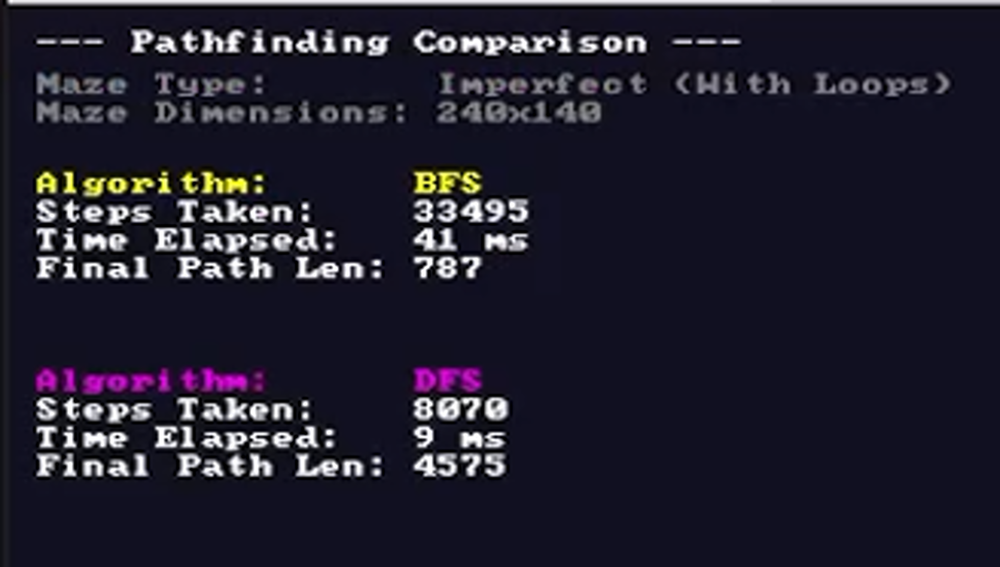

# Maze Pathfinding Visualization in Rust

This project generates random mazes and compares Breadth-First Search (BFS) and Depth-First Search (DFS) pathfinding algorithms.  
It features a real-time visualization powered by [minifb](https://github.com/emoon/rust-minifb), so you can watch both algorithms explore the maze and find a path step by step.

## Features
- Maze Generation  
  - Perfect mazes (no loops) using recursive backtracking.  
  - Imperfect mazes (with loops) by removing random walls.  

- Pathfinding Algorithms  
  - BFS → always finds the shortest path.  
  - DFS → finds a valid path, not guaranteed to be the shortest.  

- Visualization  
  - Smooth animation with configurable batch size.  
  - Start and end points clearly marked.  
  - Paths drawn in different colors for easy comparison.  
  - Stats (steps, time, path length) displayed on screen.  

- Unit Tests to ensure correctness of maze generation and pathfinding.  

## Screenshots

| BFS Exploration | DFS Exploration | Stats Screen |
|-----------------|-----------------|--------------|
|  |  |  |


## Getting Started

### 1. Clone the repo
```bash
git clone https://github.com/BSZKaneki/Knossos
cd Knossos
